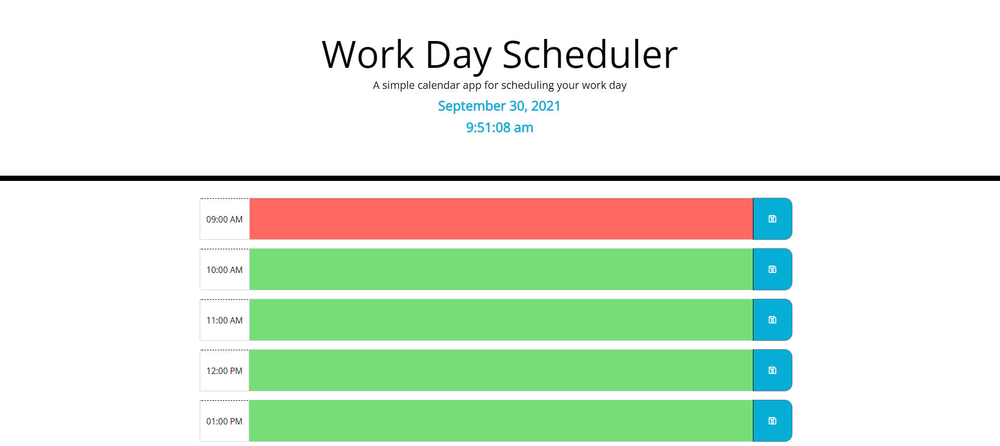
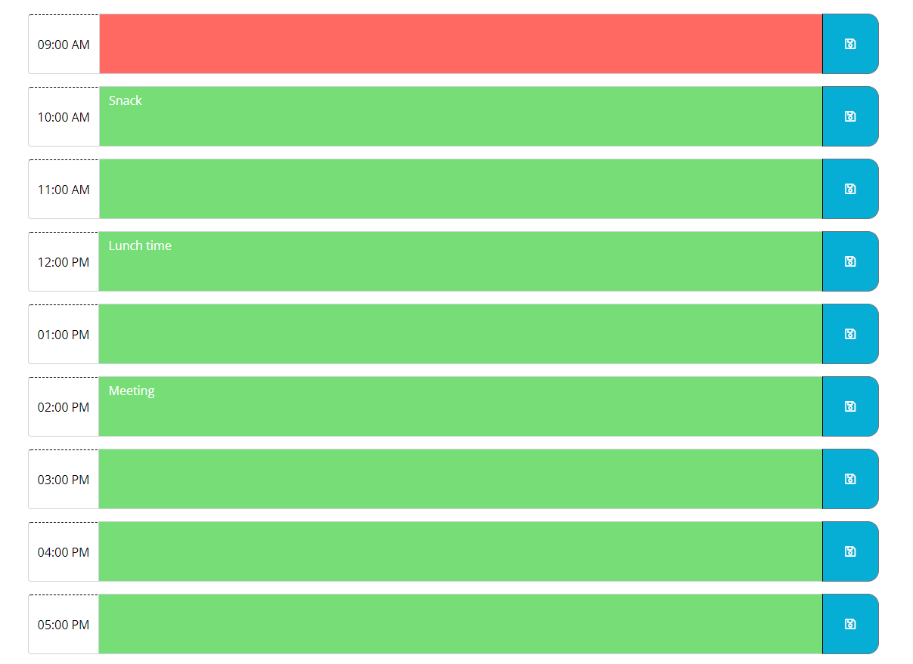
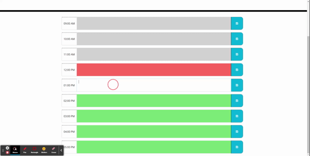

# Work-Day Scheduler

* This website is a scheduling application that allows you to input your daily schedule and save what you enter. The time slots update their color based on the time of the day, with green being the future times, red being the current, and grey being the past. The live time is also displayed at the top of the screen and upon page refresh/reload your schedule stays saved and intact.

 

## Built With

* [HTML](https://developer.mozilla.org/en-US/docs/Web/HTML)
* [CSS](https://developer.mozilla.org/en-US/docs/Web/CSS)
* [JQuery](https://jquery.com/)
* [MomentJS](https://momentjs.com/)
* [Bootstrap](https://getbootstrap.com/)

## Deployed Link

* [Work-Day Scheduler](https://derekbanister.github.io/work-day-scheduler/)

## Authors

* **DEREK BANISTER** 

- [Link to Portfolio Site](https://derekbanister.github.io/First-Portfolio/)
- [Link to Github](https://github.com/DerekBanister)
- [Link to LinkedIn](https://www.linkedin.com/in/derek-banister/)
